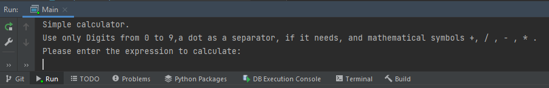
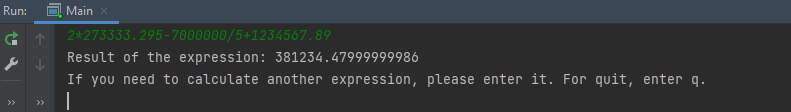
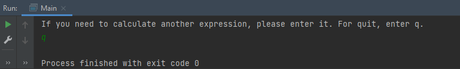

# Calculator
 Simple calculator for mathematical operations. Performs mathematical
 operations, like addition, subtraction, division and multiplication 
 on an expression obtained on the command line. 
 
## Description of the startup environment
**java version "1.8.0_261"**

tests:  
junit:junit:4.13.2  
**JUnit5.70**  

The path to run Calculator application from the command line:  
***$java -cp Calculator/out/production/Calculator com.company.Main***

If you run application from the IDE (Intellij idea or els.),
 please run com.company.Main 

## Description of Application
You can use a limited number of characters:  
Operations: +, -, /, *  
Numbers: 0, 1, 2, 3, 4, 5, 6, 7, 8, 9  
Use dot (example 12.345) as separator in real numbers.  
You can use braces "(" or ")" for nagative numbers (example (-2,75)-(-7) )  
Whitespaces or other charachters are not allowed and will rise an exception.  

## How it works
1. First, you get a greeting, as in the example below:

2. Second, you should enter your expression, that you need to calculate.  
for example: ***2\*273333.295-7000000/5+1234567.89***

3. Please press Enter key. And you will see the result of the calculation. 

4.1. If you need to exit from application enter 'q' key on keyboard.

4.2. Else you need to repeat the calculations enter a new expression.

### Licence
Unlicence